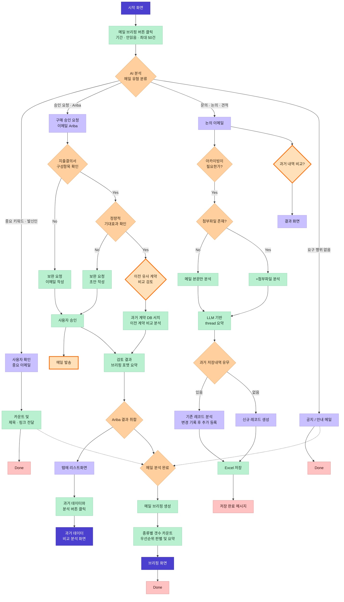

# User Flow — 스토리보드 정규화

원본은 FigJam 보드를 캡처한 [`docs/storyboard/`](../storyboard/)의 PNG 6장이다.
**PNG는 증거이고 수정하지 않는다.** 이 폴더는 그것을 사람과 LLM이 함께 읽을 수 있게 옮긴 것이다.

| 파일 | 누구를 위한 것 | 내용 |
| --- | --- | --- |
| [`flow.yaml`](flow.yaml) | LLM · 코드 | 노드·엣지·색상 범례·이미지 역참조·확신도 |
| [`criteria.yaml`](criteria.yaml) | 스킬 · 테스트 | 회색 스티커의 판정 기준을 규칙 데이터로 |
| 이 파일 | 사람 | 그림·용어·아직 안 정해진 것 |

**기준을 바꿔야 하면 `criteria.yaml`을 먼저 고친다.** 스킬 문서에서 기준을 새로 만들지 않는다.
그림과 이 문서가 어긋나면 그림이 이긴다.

## 전체 흐름



굵은 주황 점선 테두리는 **보드에 주황 별이 붙은 미해결 노드**다.

### 색이 뜻하는 것

| 색 | 뜻 |
| --- | --- |
| 진한 보라 | 사용자가 보는 화면 |
| 연한 보라 | 분류 결과 또는 데이터 상태 |
| 초록 | 시스템 또는 사용자의 행위 |
| 주황 마름모 | 분기 |
| 분홍 | 종료 |
| 회색 스티커 | 판정 기준 → `criteria.yaml`로 옮김 |
| 주황 별 | 아직 정해지지 않음 → 아래 미해결 목록 |

## 지금 구현하는 범위

파란 경로만 코드로 만든다. 나머지는 스펙으로 남긴다.

```
시작 화면 → 브리핑 버튼 → 유형 분류 → 4갈래 → 분석 완료
          → 브리핑 생성 → 카운트·우선순위 → 브리핑 화면 → Done
```

Ariba 3단 게이트와 논의 이메일 아카이빙은 `flow.yaml`·`criteria.yaml`에 전부 적혀 있지만
이번 스프린트에서 코드로 만들지 않는다. 범위를 좁힌 이유는 **스킬 하니스가 효과가 있는지 먼저
측정**하기 위해서다. 측정 결과를 보고 다음 범위를 정한다.

## 용어

| 용어 | 뜻 |
| --- | --- |
| **Ariba** | SAP의 기업용 구매·조달 시스템. 구매요청(PR) 승인이 여기서 돌아간다 |
| **지출결의서** | 돈을 쓰기 전 무엇을·얼마에·왜 사는지 적어 결재받는 문서 |
| **구성항목** | 지출결의서에 반드시 있어야 하는 항목 — 아이템, 금액, 산정근거 |
| **산정근거** | 그 금액이 나온 계산 과정. 견적 3사 비교, 단가 × 수량 등 |
| **정량적 기대효과** | 숫자로 표현되고 계산 근거가 붙은 효과. "매출 3% 증가(근거: …)" |
| **정성적 기대효과** | 숫자가 없는 효과. "브랜드 인지도 향상" — 보드는 이것만 있으면 미비로 본다 |
| **보완 요청** | 빠진 정보를 채워달라고 요청자에게 보내는 메일 |
| **투자성 지출** | 당장 비용이 아니라 미래 수익을 기대하고 쓰는 돈 |

## 미해결 — 사람이 정해야 하는 것

추론으로 안전 경계를 넓히지 않는다. 모호하면 `certainty`를 낮추고 여기에 남긴다.

1. **발송 권한 정책** ← 가장 중요
   보드는 `사용자 승인 → 메일 발송`으로 끝나지만, 현행 안전 경계는 **초안까지**다
   ([AGENTS.md](../../AGENTS.md)). 발송을 허용할지, 허용한다면 어떤 조건에서인지 정해지지 않았다.
   `flow.yaml`의 `END-MAIL-SENT`가 `certainty: undecided`인 이유다.

2. **★ 이전 유사 계약과 비교 검토** — 비교 대상 계약 DB가 무엇인지 보드에 없다.
   파일인지, 시스템인지, 사람이 넣어주는 자료인지 정해야 구현이 시작된다.

3. **★ 과거 내역 비교 (협상력 가격 비교)** — 다른 사업부·다른 시점의 유사 구매 이력과 비교해
   가격 합리성 근거를 자동으로 붙이는 기능. 구현 범위 미정. (작성자 서정)

4. **중요 키워드 목록 미완결** — 보드에 `키워드 더 추가해 주세요` 메모가 붙어 있다.
   `criteria.yaml`의 `important_email`이 `status: open`인 이유다.

5. **브리핑 우선순위 티어 순서** — 보드는 `금액순 top5 / 세금·tax / 지급기일 초과` 세 항목을
   **나열만** 했다. 순위를 매기려면 순서가 필요해서 T1~T6으로 해석했고, 그 해석 부분은
   `criteria.yaml`에 `certainty: interpreted`로 표시해 두었다. 사람이 확정하면 올린다.

6. **기대효과 미비 판정의 `~50%`** — 보드 표기가 `투자액 대비 수익률이 ~50% 미만인 경우`인데
   부등호 방향과 기준 기간이 모호하다.

7. **읽음/읽지않음 기본값** — 기본은 읽지 않음, 리스트에서 버튼으로 선택 가능. (작성자 HJK)
   UI 구현 시 확인 필요.

8. **브리핑 템플릿** — 보드에 `브리핑 템플릿 링크` 스티커가 있으나 링크 대상이 캡처에 없다.

## 원본을 다시 볼 때

일반적인 분류·브리핑 작업에서는 PNG를 열지 않는다. `flow.yaml`과 `criteria.yaml`이 실행 명세다.

PNG를 여는 경우는 넷뿐이다.

- UI를 구현하며 화면 배치를 확인할 때
- 이 문서와 그림이 어긋나 보일 때
- 보드가 갱신되어 반영해야 할 때
- 텍스트 명세에 없는 분기를 확인해야 할 때

그림에서 새 사실을 읽어냈으면 **확정된 동작과 해석을 구분해서** `flow.yaml`에 반영하고,
정해지지 않은 것은 위 목록에 추가한다.
